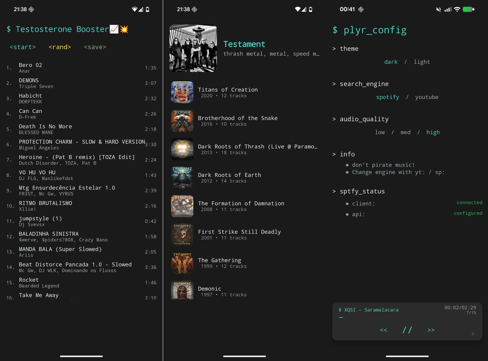

# _plyr



Android music plyr built with Kotlin and Jetpack Compose. Stream music from YouTube, organize playlists, and control playback.

## Build

Made a small shell script to simplify the build process:

```bash
# Clone the repository
git clone https://github.com/yourusername/plyr.git
cd plyr

# Run the build script
./run.sh
```

## Project Structure

```
plyr/
├── app/src/main/java/com/plyr/
│   ├── database/      # Room entities
│   ├── network/       # API integration
│   ├── ui/            # Compose screens
│   ├── viewmodel/     # State management
│   ├── service/       # Background services
│   └── utils/         # Utilities
├── gradle/            # Dependencies
└── README.md
```

## Permissions

```xml
<uses-permission android:name="android.permission.INTERNET" />
<uses-permission android:name="android.permission.FOREGROUND_SERVICE" />
<uses-permission android:name="android.permission.FOREGROUND_SERVICE_MEDIA_PLAYBACK" />
<uses-permission android:name="android.permission.WAKE_LOCK" />
<uses-permission android:name="android.permission.POST_NOTIFICATIONS" />
<uses-permission android:name="android.permission.CAMERA" />
```

## Roadmap

- [ ] **Smart Recommendations** - Playlist recommendations based on your music taste
- [ ] **Drag & Drop** - Reorder songs in playlists with long press and drag
- [ ] **Now Playing Indicator** - Highlight current track with color change in playlists
- [ ] **Fix add to playlist songs** - When swipe song to add to playlist, playlists don't show up
- [ ] **Fix dark Mode** - Some screens have white background or not enough contrast

## License

none yet

---

**Made with ♫ by me**
