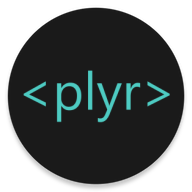
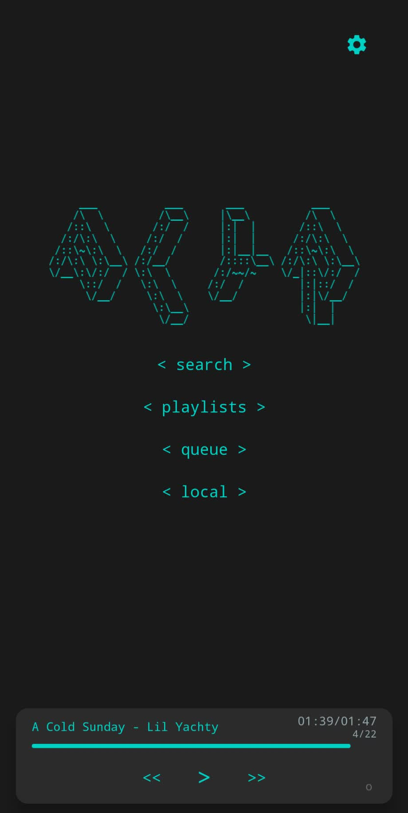
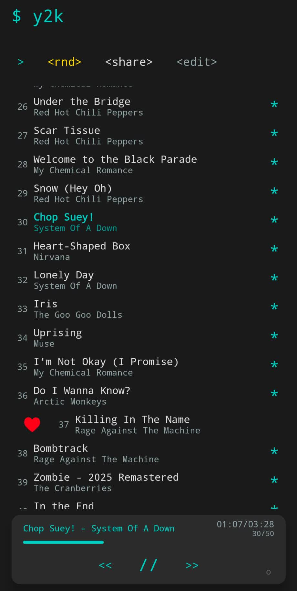
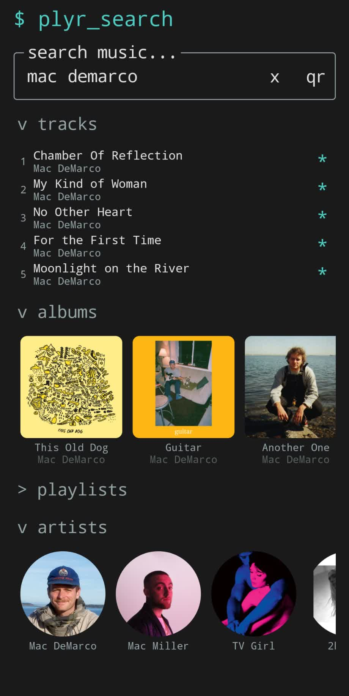

**A minimalist, terminal-inspired music player for Android**

[](https://www.gnu.org/licenses/gpl-3.0)
[](https://www.android.com)
[](https://kotlinlang.org)

Built this music player because I wanted something simple with a terminal aesthetic. Streams audio from YouTube (via NewPipe Extractor, no API key required), manages local playlists, and has swipe actions for quick operations. The UI is ASCII-inspired with monospace fonts everywhere.

## features

- **YouTube streaming** — search and play any song (NewPipe Extractor).
- **Local playlists** — create, edit and reorder playlists; import a playlist from a **Spotify URL**
- **Scan & share** — share a playing track/playlist as QR or NFC tag; scan to open it.
- **Backup** — pick a folder once and a `plyr-sync.zip` inside it keeps itself up to date on its own .
- **Swipe actions** — configurable left/right swipe on a song: queue, like, playlist or share. 
- **Auto theme** by ambient light via the device light sensor.
- **Recommendations feed** — community playlist recommendations synchronized via Supabase.
- **Background playback** — Media3 (ExoPlayer) foreground service with media notification controls.
- **Media buttons** — play/pause, next, previous and 10 s skip from wireless headsets, Bluetooth and the notification.

## screenshots

<div align="center">
  
  
  
</div>

## build from source

There is a bash script in case you want to build from source; take a look at `./run.sh help` for all available commands.
```bash
git clone https://github.com/josemri/plyr.git
cd plyr
./run.sh build        # builds the debug APK
./run.sh run          # compiles, installs and launches the app on the device
./run.sh test         # runs the unit tests
./run.sh check        # code analysis: detekt (dead code/structure), lint and test coverage
```

The script mounts its own environment (Java, Android SDK) under `/tmp`, so nothing is written to your home directory. Run `./run.sh clean` to wipe everything it generates.

## project structure

```
plyr/
├── app/src/main/java/com/plyr/
│   ├── database/      # Room entities, DAOs & migrations
│   ├── model/         # Pure data models (ScanResult, AppTrack, Recommendation...)
│   ├── network/       # SupabaseClient, YouTubeManager, SimpleDownloader
│   ├── receivers/     # MediaButtonReceiver, MediaButtonCommand
│   ├── service/       # MusicService, YouTubeSearchManager, YouTubePlaylistCreator
│   ├── ui/            # Compose screens & components
│   ├── utils/         # Config, UrlParser, Translations, NfcReader, SpotifyImporter, DataSync, BackupFolder, CoverCache
│   └── viewmodel/     # PlayerViewModel, ImportViewModel
├── gradle/            # Dependencies (libs.versions.toml)
└── run.sh             # Build/install/test script
```

## permissions

```xml
NFC                       # Tag scanning / sharing of playlists
INTERNET                  # Stream music and fetch metadata
FOREGROUND_SERVICE        # Background playback
FOREGROUND_SERVICE_MEDIA_PLAYBACK
POST_NOTIFICATIONS        # Playback controls
CAMERA                    # QR code scanning (optional hardware)
```

`chmod 600 local.properties` and keep your keystore out of the repo — no secrets are tracked.

## roadmap

Everything already fixed is documented in [`report.md`](report.md) — **63 bugs resolved, 0 open**, 478 unit tests.

- [ ] **Download lists** — download playlists for offline use
  - [ ] Download the audio of each track and store it locally
  - [ ] Play from local when available
  - [ ] Per-track progress/status and storage management
- [ ] **Android Auto** — support for the Android Auto interface
  - [ ] Declare `automotive_app_desc.xml` and the automotive permissions
  - [ ] Expose the library (playlists, queue) through the Media3 `MediaSession`
  - [ ] Playback screen and controls in the head unit

## license

[](https://www.gnu.org/licenses/gpl-3.0.en.html)

**_plyr** is Free Software: You can use, study, share, and improve it at will. Specifically you can redistribute and/or modify it under the terms of the [GNU General Public License](https://www.gnu.org/licenses/gpl-3.0.en.html) as published by the Free Software Foundation, either version 3 of the License, or (at your option) any later version.

This project uses:

- [NewPipeExtractor](https://github.com/TeamNewPipe/NewPipeExtractor), originally created by [Team NewPipe](https://github.com/TeamNewPipe), licensed under GPL-3.0.
- [ExoPlayer / Media3](https://developer.android.com/media/media3), [Room](https://developer.android.com/jetpack/androidx/releases/room), [Compose](https://developer.android.com/jetpack/compose), [OkHttp](https://square.github.io/okhttp/), [Coil](https://coil-kt.github.io/coil/) and [CameraX](https://developer.android.com/training/camerax), each under their respective licenses.

---

<div align="center">
  <b>Made with ♫ by <a href="https://github.com/josemri">josemri</a></b>
</div>
